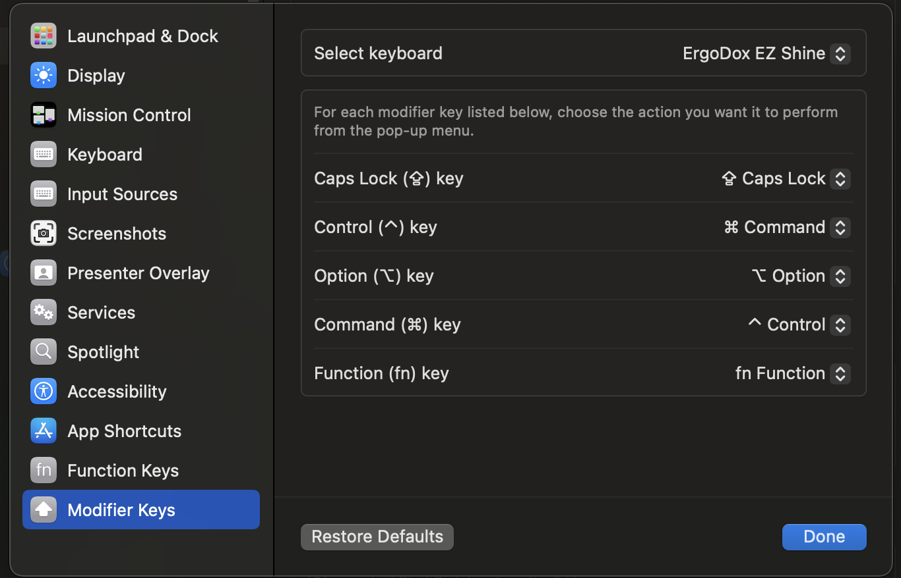
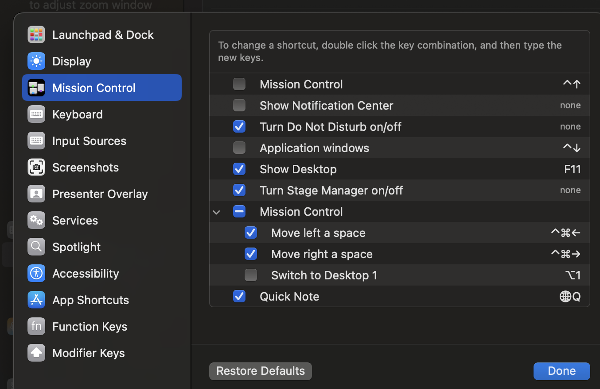

# Dotfiles

Most of these are optimized for my [keyboard layout](https://configure.zsa.io/ergodox-ez/layouts/L4wD0/latest/0). Might be nice to use nix or something instead of all these apps/configs, someday it'll be a script but I only need it every year or so.

### Tools

- cli tools: `brew install lsd ripgrep bat zoxide`
- kubectl: https://kubernetes.io/docs/tasks/tools/install-kubectl-macos/
- alacritty: `brew install --cask alacritty`
- ohmyzsh: `sh -c "$(curl -fsSL https://raw.githubusercontent.com/ohmyzsh/ohmyzsh/master/tools/install.sh)"`
- install p10k: `git clone --depth=1 https://github.com/romkatv/powerlevel10k.git ${ZSH_CUSTOM:-$HOME/.oh-my-zsh/custom}/themes/powerlevel10k && source ${ZSH_CUSTOM:-$HOME/.oh-my-zsh/custom}/themes/powerlevel10k/powerlevel10k.zsh-theme`
- plugins: `git clone https://github.com/zsh-users/zsh-syntax-highlighting ~/.oh-my-zsh/custom/plugins/zsh-syntax-highlighting && git clone https://github.com/zsh-users/zsh-syntax-highlighting ~/.oh-my-zsh/custom/plugins/zsh-syntax-highlighting`
- tmux: `brew install tmux`
- tmux plugin manager: https://github.com/tmux-plugins/tpm
- tmux theme plugin: https://github.com/catppuccin/tmux?tab=readme-ov-file#manual-recommended
- neovim: [prereqs](https://github.com/neovim/neovim/blob/master/BUILD.md#macos) and build from source
- fonts: https://github.com/romkatv/powerlevel10k?tab=readme-ov-file#meslo-nerd-font-patched-for-powerlevel10k
- gpg: https://gpgtools.org/
- lazygit: https://github.com/jesseduffield/lazygit?tab=readme-ov-file#installation
- nvm (npm/node): https://github.com/nvm-sh/nvm?tab=readme-ov-file#install--update-script
- git-credential-manager: https://github.com/git-ecosystem/git-credential-manager/blob/release/docs/install.md

### setup

```sh
cp -r .config/ ~/.config/
cp -r home/* ~
```


