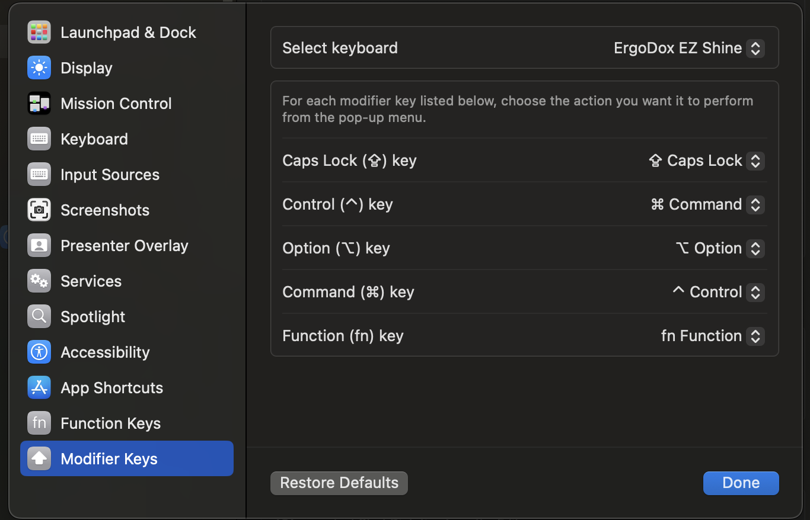
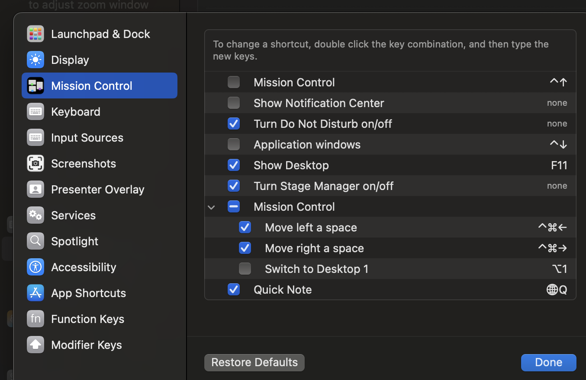

# Dotfiles

Most of these are optimized for my [keyboard layout](https://configure.zsa.io/ergodox-ez/layouts/L4wD0/latest/0). Might be nice to use nix or something instead of all these apps/configs, someday it'll be a script but I only need it every year or so.

### Tools

CLI:

- core: `brew install lsd ripgrep bat fd sd zoxide fzf glow tlrc jq`
- dev: `brew install gh git-credential-manager lazygit direnv`
- editors: `brew install helix` (or build from source); neovim from source (see [prereqs](https://github.com/neovim/neovim/blob/master/BUILD.md#macos))
- file managers: `brew install yazi lf`
- formatters: `brew install prettier shfmt stylua taplo ruff`
- tmux + session picker: `brew install tmux sesh`
- k8s: `brew install kubectl`
- nvm: https://github.com/nvm-sh/nvm (note: lazy-loaded in `.zshrc`)
- claude code: https://docs.claude.com/en/docs/claude-code

Apps:

- terminal: `brew install --cask ghostty` (or `alacritty`)
- fonts: `brew install --cask font-meslo-lg-nerd-font font-symbols-only-nerd-font`
- gpg: https://gpgtools.org/

Shell:

- ohmyzsh: `sh -c "$(curl -fsSL https://raw.githubusercontent.com/ohmyzsh/ohmyzsh/master/tools/install.sh)"`
- p10k: `git clone --depth=1 https://github.com/romkatv/powerlevel10k.git ${ZSH_CUSTOM:-$HOME/.oh-my-zsh/custom}/themes/powerlevel10k`
- zsh-syntax-highlighting: `git clone https://github.com/zsh-users/zsh-syntax-highlighting ~/.oh-my-zsh/custom/plugins/zsh-syntax-highlighting`
- zsh-autosuggestions: `git clone https://github.com/zsh-users/zsh-autosuggestions ~/.oh-my-zsh/custom/plugins/zsh-autosuggestions`

tmux:

- plugin manager (tpm): https://github.com/tmux-plugins/tpm
- catppuccin theme: https://github.com/catppuccin/tmux

Rust toolchain (for `rust-analyzer` in helix/nvim):

- `curl --proto '=https' --tlsv1.2 -sSf https://sh.rustup.rs | sh`
- `rustup toolchain install nightly`
- `rustup component add rust-analyzer --toolchain nightly`

### setup

```sh
cp -r home/. ~/   # copies dotfiles + .config/ (the trailing `.` makes cp include hidden files)

# Symlink rustup's nightly rust-analyzer into PATH (used by helix/nvim via $HOME/bin).
mkdir -p ~/bin
ln -sf ~/.rustup/toolchains/nightly-aarch64-apple-darwin/bin/rust-analyzer ~/bin/rust-analyzer
```



