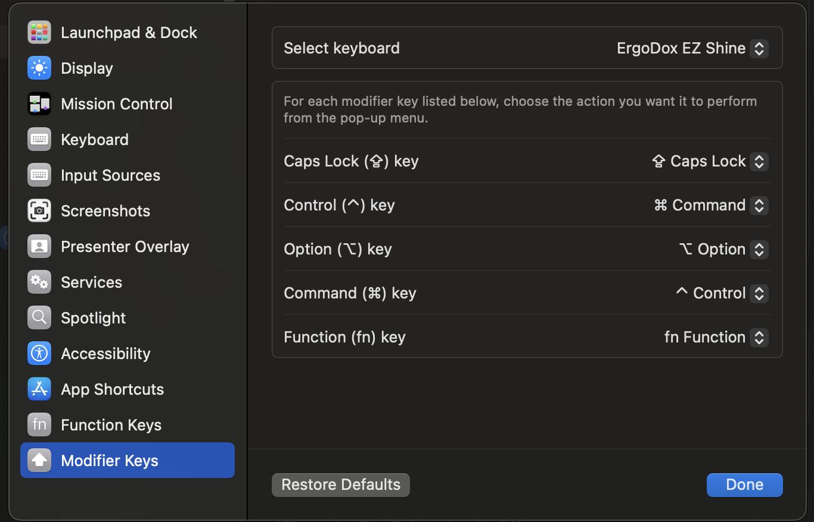
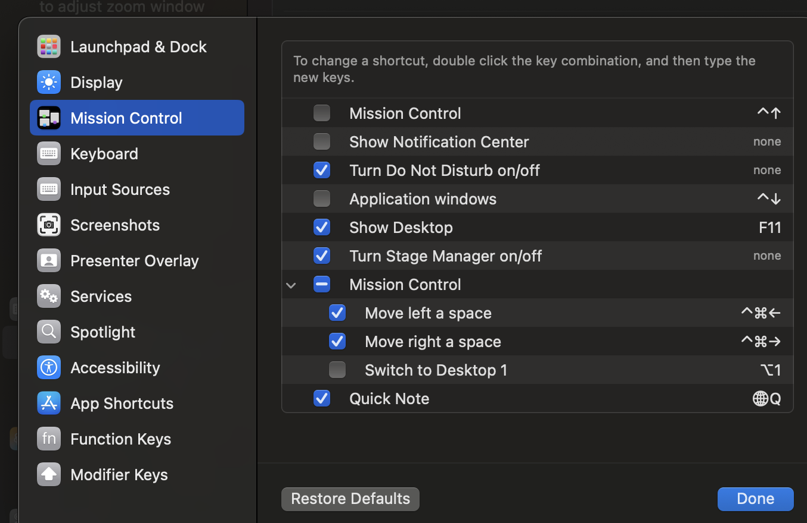

# Dotfiles

Most of these are optimized for my [keyboard layout](https://configure.zsa.io/ergodox-ez/layouts/L4wD0/latest/0). Might be nice to use nix or something instead of all these apps/configs, someday it'll be a script but I only need it every year or so.

### Tools

CLI:

- core: `brew install lsd ripgrep bat fd sd zoxide fzf glow tlrc jq`
- dev: `brew install gh lazygit direnv git-delta protobuf`
  - `git-delta` is wired in as git's pager and `interactive.diffFilter` (see `.gitconfig`) — without it, `git diff` fails.
- build-from-source deps (helix, tmux-thumbs): `brew install cmake ninja curl`
- databases (match `.psqlrc` / `.sqliterc`): `brew install postgresql@16 libpq@16 pgvector sqldiff pspg`
  - migrations: `brew install sqitchers/sqitch/sqitch --with-postgres-support --with-sqlite-support`
    plus `brew install cpm` (sqitch is a Perl app; `cpm` installs its CPAN deps). Every engine is an
    opt-in build option — without `--with-postgres-support` you get a sqitch that can't talk to
    Postgres. The tap has no bottle, so each install compiles against the current perl and bakes
    that Cellar path into the wrapper's shebang: after a perl major bump sqitch dies with `bad
    interpreter: No such file or directory` and the same install command (as `reinstall`) is the fix.
    `bootstrap.sh` detects the dead interpreter and rebuilds.
  - GCP: `brew install cloud-sql-proxy`
  - `pspg` is psql's pager, set as `PSQL_PAGER` in `.psqlrc` — frozen header row while you scroll
    right, cursor navigation, `/` search, `a`/`d` sort, F9 for the menu and theme picker. `PAGER`
    stays plain `less` so `\h` help text is unaffected. `:less` / `:pspg` switch mid-session.
  - theme is `.pspg_theme_catppuccin` (Mocha), loaded by `--custom-style=catppuccin`. pspg looks
    for it at `dirname($PSPG_CONF)/.pspg_theme_<name>`, and `PSPG_CONF` defaults to `~/.pspgconf`
    — so the file has to sit at `~/.pspg_theme_catppuccin`, not under `~/.config`.
    - it sets `template = 5` (Mutt) because that is one of only three built-ins — `0`, `5`, `16`
      — that leave background/data/border as terminal `Default`. Every other built-in, Dracula
      included, hardcodes its own background and fights the terminal. Only accents are overridden.
    - **no `#` comments in that file** — `#` is the hex-color prefix, so a comment line parses as
      a broken RGB value and pspg nags "some fields ignored" on every query. Keep it keys-only.
    - the key for unhighlighted search matches is `mathed_pattern_nohl`. That misspelling is
      upstream in `theme_loader.c`; the README's `matched_pattern_nohl` silently does nothing.
    - `template_menu = 8` (NOCOLOR) is deliberate, not laziness. The menu templates are a separate
      enum in `st_menu.h`, unrelated to the table theme numbers, and most force their own colors.
      `5` (FAND_2) sets the accelerator pair to `COLOR_CYAN, COLOR_CYAN` in `st_menu_styles.c` —
      hotkey letters invisible against their own background, so F9 reads "ile / earch / ommand".
      `8` inherits the terminal and underlines accelerators instead; it also has `shadow_width = 0`,
      which drops the light drop-shadow the other styles smear to the right of the dropdown.
    - `label` colors the header row *and* any frozen column (`-c 1`), with no way to split them —
      so it stays muted lavender rather than mauve; a whole frozen id column of accent is too loud.
    - to debug it: `pspg --log=/tmp/pspg.log …` records every rejected line.
  - `-c 1` freezes the first column so it stays put while you scroll right. That's what makes
    `\x off` (rather than `auto`) workable — wide rows scroll sideways instead of going expanded.
  - it pages tables, it does not format JSON — for a wide jsonb column use
    `select jsonb_pretty(col) …` with `\x on` for that query.
- yazi previewers: `brew install poppler ffmpeg sevenzip` (PDF / video / archive previews — yazi calls these implicitly, they aren't named in `yazi.toml`)
- docs: `brew install pandoc typst`
- language servers, native: `brew install marksman ruff`; `rust-analyzer` via rustup (below)
- language servers, node: **not from brew** — they come from `~/.nvm/default-packages`, see the node
  section below. That's `@vtsls/language-server vscode-langservers-extracted yaml-language-server bash-language-server`.
  - these used to come from nvim's Mason; with nvim gone they're installed standalone
  - `vscode-langservers-extracted` is one package covering five servers: json / html / css / eslint / markdown
  - `vtsls` is what `helix/languages.toml` names for ts/tsx/js — not `typescript-language-server`
  - not installed, add if you need them: `lua-language-server` (only Lua here was the nvim config), `gopls`
  - `hx --health <lang>` only checks that the binary _exists_. Use `toolchain-check` (in
    `~/.local/bin`) to check they actually run — see below for why that distinction matters.
- gh extensions:
  - `gh extension install dlvhdr/gh-dash` (PR/issue dashboard; bound to `prefix+h` in tmux)
  - `gh extension install dlvhdr/gh-enhance` (CI detail TUI for a PR; bound to `T` in gh-dash — see the `enhance` keybinding in `home/.config/gh-dash/config.yml`)
- editors: helix, built from source — see the helix section below
- file managers: `brew install yazi lf`
- formatters: `brew install shfmt stylua taplo ruff` — plus `prettier`, which comes from nvm (node section below), not brew
- tmux + session picker: `brew install tmux sesh`
- k8s: `brew install kubectl`
- system monitors: `brew install bottom macmon`
  - `bottom` installs as `btm`, not `bottom` — cross-platform process/CPU/mem/net graphs
  - `macmon` is Apple-silicon only: reads SMC/IOReport for per-cluster CPU + GPU + ANE power draw
    and temps, which `btm` and Activity Monitor don't show
- code review: `brew install tuicr` — a diff/review TUI with vim keys (`cr`, `crw` in `.bash_aliases`)
  - **not a pager.** It renders the diff itself, so `[delta]` in `.gitconfig` and `$PAGER` have no
    effect inside it. The equivalent knob is `diff_view` in `~/.config/tuicr/config.toml`, set to
    `side-by-side` to match delta; `:diff` toggles unified mid-review, `:set wrap!` wraps.
  - `tuicr -w` reviews the working tree, `-r main..HEAD` a range, `tuicr pr N` a GitHub PR over
    `gh`'s auth, `-A` every tracked file. No argument opens a commit selector.
  - `c`/`C`/`v` comment on a line / file / range, `r`/`R` mark a file / hunk reviewed, `m` jumps
    comment to comment, `e` opens the file in `$EDITOR`, `?` for the full list.
  - moving between files: `;h` focuses the tree, then plain `j`/`k` walk it and `Enter` jumps the
    diff there **and hands focus back to the diff** — so it's `;h j j Enter`, not a mode you have to
    escape. `{`/`}` (prev/next file) and `[`/`]` (prev/next hunk) do the same thing without leaving
    the diff. There is no keybinding config: `leader` and `comment_vim` are the only key-related
    options, so `{`/`}` can't be remapped — use the tree if the braces don't stick.
  - within a diff: `g`/`G` first/last file, `/` search, `NG` jump to source line N. Everything takes
    a vim count prefix (`5j`, `3}`).
  - the tree is a real panel, not decoration: `;e` toggles it, `/` substring-searches paths, `i`/`e`
    include/exclude by regex (`I`/`E` clear), `o`/`O` expand/collapse all. Filters hide files from
    the diff and from `{`/`}` too, not just from the tree. `;l` returns to the diff, `Tab` cycles
    panels. `;` is the leader, settable via `leader` in `config.toml`.
  - `prefix R` opens it in a tmux window (`r` is still the config reload; `R` used to duplicate it)
  - `y` copies the review as numbered `file:line` markdown to paste at an agent; `:submit` pushes a
    real inline review to GitHub. Reviews persist per repo — `tuicr review list`.
  - themes are its own, not helix's: `catppuccin-mocha` here, `~/.config/tuicr/themes/*.toml` for
    local ones. `tuicr update` self-updates, but brew owns this install, so let brew do it.
- benchmarking: `brew install hyperfine` (`bench` = `hyperfine --warmup 3`)
  - no config file, all flags. `--warmup N` so a cold cache doesn't skew run one, `-L param a,b,c`
    for sweeps over a `{param}` placeholder, `--prepare` to reset state between runs,
    `--export-markdown` for a PR-ready table.
- nvm: https://github.com/nvm-sh/nvm — the only node source; `.zshenv` puts the default version on `PATH`, `.zshrc` keeps lazy stubs for switching. See the node section below
- claude code: https://docs.claude.com/en/docs/claude-code

Apps:

- terminal: `brew install --cask ghostty`
- fonts: `brew install --cask font-meslo-lg-nerd-font font-symbols-only-nerd-font`
- git creds: `brew install --cask git-credential-manager` (cask, not a formula)
- tunnels: `brew install --cask ngrok`
- gpg: https://gpgtools.org/

Shell:

- ohmyzsh: `sh -c "$(curl -fsSL https://raw.githubusercontent.com/ohmyzsh/ohmyzsh/master/tools/install.sh)"`
- p10k: `git clone --depth=1 https://github.com/romkatv/powerlevel10k.git ${ZSH_CUSTOM:-$HOME/.oh-my-zsh/custom}/themes/powerlevel10k`
- zsh-syntax-highlighting: `git clone https://github.com/zsh-users/zsh-syntax-highlighting ~/.oh-my-zsh/custom/plugins/zsh-syntax-highlighting`
- zsh-autosuggestions: `git clone https://github.com/zsh-users/zsh-autosuggestions ~/.oh-my-zsh/custom/plugins/zsh-autosuggestions`

tmux:

- plugin manager (tpm): https://github.com/tmux-plugins/tpm
- catppuccin theme: https://github.com/catppuccin/tmux
- plugins install with `prefix+I` after tpm is set up
- tmux-thumbs (hint-copy, `prefix+Space`; `prefix+O` opens what it copied): Rust plugin — needs `cargo` (from the Rust toolchain below) to build on first install

helix:

Currently built from source at `~/mystuff/helix` and wired up with two symlinks. **The second one is not optional** — a source build with no runtime tree has no syntax highlighting, no themes, and no queries.

(brew is at the same version, `25.07.1`. `brew install helix` handles its own runtime, so switching would make both symlinks unnecessary — the from-source setup is a choice, not a requirement.)

```sh
git clone https://github.com/helix-editor/helix ~/mystuff/helix
cd ~/mystuff/helix && cargo build --release          # needs the Rust toolchain below

sudo ln -sf ~/mystuff/helix/target/release/hx /usr/local/bin/hx   # binary onto PATH
ln -sfn ~/mystuff/helix/runtime ~/.config/helix/runtime           # grammars, queries, themes
```

- `theme = "catppuccin_mocha"` in `config.toml` ships inside that runtime tree — nothing extra to install
- `sync.sh` deliberately skips `.config/helix/runtime`; it's a symlink into the source checkout, not config
- everything helix needs at runtime is in the language-servers and formatters lines above; `hx --health <lang>` confirms per language
- keybindings, workflows, and LSP gotchas: [`docs/helix-daily-driving.md`](./docs/helix-daily-driving.md). It lives in `docs/` rather than under `home/.config/helix/` deliberately — `sync.sh` doesn't walk `docs/`, so the doc can't be clobbered by a sync from a stale live copy.

Node:

**One node source: nvm.** No homebrew node, and none of the node-based tooling from homebrew either.
The reason is measurable — `otool -L` on each binary:

|                                   | homebrew dylibs it links                                                              |
| --------------------------------- | ------------------------------------------------------------------------------------- |
| `/opt/homebrew/bin/node`          | **22** (llhttp, libuv, ada-url, simdjson, brotli, c-ares, openssl@3, sqlite, zstd, …) |
| `~/.nvm/versions/node/*/bin/node` | **0** — CoreFoundation, Security, libc++, libSystem, nothing else                     |

nvm installs the official Node.org tarball, which is statically self-contained. Homebrew rebuilds node
against brew's dependency graph, giving 22 independently-versioned chances for a major bump to break
it. That's not hypothetical: `ada-url` 3 → 4 landed without node being rebottled and killed node at
load with `Library not loaded: libada.3.dylib`, taking all 5 node formulae and 9 binaries with it —
`prettier`, `vtsls`, `yaml-language-server`, `bash-language-server`, and the five
`vscode-{json,html,css,eslint,markdown}-language-server` binaries. In helix that looked like
format-on-save silently doing nothing and no completions in ts/json/yaml/bash, while `hx --health`
still printed ✓ for every one of them.

**How the pieces fit.**

- `~/.nvm/alias/default` is pinned to a **concrete version**, not the floating `node` alias.
  `.zshenv` prepends that version's `bin` to `PATH` by reading the alias file — no `nvm.sh` sourcing,
  so it costs <1ms against ~420ms to source nvm. `.zshenv` (not `.zshrc`) because it's read for
  non-interactive shells too, which is what helix and anything it spawns depend on.
- `.zshrc` keeps the lazy `nvm`/`node`/`npm`/`npx` stubs, but only for switching versions. The default
  node already works in a shell where they've never fired.
- **`~/.nvm/default-packages`** lists the tooling, so every `nvm install` gets it. Without this,
  switching node makes the tools vanish: npm globals are per-version, and `nvm use` _replaces_ its
  `PATH` entry rather than stacking on it (`nvm_change_path`, `nvm.sh:1000`).
- Project overrides work normally — `cd ~/ukon/ui && nvm use` picks up its `.nvmrc` (22.22.0, the only
  `.nvmrc` in the tree) and the tooling is still resolvable because `default-packages` installed it
  under that version too.

**Don't try to make npm globals version-independent.** Setting `PREFIX` or `NPM_CONFIG_PREFIX` to a
fixed directory is the obvious fix and nvm hard-fails on it: `nvm_die_on_prefix` (`nvm.sh:2760`) is
called by `nvm use` (`nvm.sh:3933`) and returns 11. `default-packages` plus
`nvm reinstall-packages <version>` is the sanctioned path.

**Trade-off accepted.** No `brew upgrade` for these six, so updates are manual — `toolchain-check -u`
runs `npm --location=global outdated`. And tooling versions can drift between node versions; pin them
in `default-packages` (`prettier@3.9.5`) if format-on-save output ever differs between repos.

Package managers come from the repo, not globally: `ukon/infra` declares pnpm@10.5.1,
`ukon/ukon-core` pnpm@10.2.0, `rust-ceramic/sdk` pnpm@9.8.0. `corepack enable` honours each; one
global `pnpm` can only match one of them. Run it once per node version you develop on.

**`default-packages` only fires on a _fresh_ install.** Write the file first and `nvm install` does
everything — no `npm i -g` afterwards. But running `nvm install` against a version that's **already**
installed will not apply it, because the guard on that path is inverted: the fresh-install branch
tests `[ $EXIT_CODE -eq 0 ]` (`nvm.sh:3653`) while the already-installed branch tests
`[ $EXIT_CODE -ne 0 ]` (`nvm.sh:3549`), so it only runs when the preceding step _failed_. Same
variable, same purpose, opposite condition — a bug in nvm 0.40.2 (not checked against upstream since).
For a version you already have, install into it explicitly:

```sh
nvm use 22.22.0 && nvm reinstall-packages "$(cat ~/.nvm/alias/default)"
```

Setup, and recovery if any of this comes apart:

```sh
cat > ~/.nvm/default-packages <<'EOF'
prettier
@vtsls/language-server
vscode-langservers-extracted
yaml-language-server
bash-language-server
EOF

nvm install 26                                  # fresh install → default-packages applies itself
nvm alias default v26.6.0                       # concrete version; .zshenv needs a real directory name

nvm use 22.22.0 && nvm reinstall-packages v26.6.0   # already installed, so see the bug above
nvm use default

brew uninstall prettier vtsls vscode-langservers-extracted \
               yaml-language-server bash-language-server node

toolchain-check                                 # expect 12 ok
```

**corepack is not bundled from node 25 onward** — `v26.6.0/bin` has no `corepack`, `v22.22.0/bin`
does. That's fine in practice: the repos with `packageManager` pins run on node 22 or older
(`engines.node >=18`), so `corepack enable` works where it's actually needed. On node 26, add
`corepack` to `default-packages` if you ever want it there.

Python:

Only used for scripts, so there's one global ruff config instead of per-project setup — `home/.config/ruff/pyproject.toml` → `~/.config/ruff/pyproject.toml`. Ruff does lint + format; no type checker (hover/completions come from Pylance in VS Code and windsurfpyright in Devin).

- `brew install ruff`
- the global config applies to any script, and to repos whose `pyproject.toml` has no `[tool.ruff]` section
- a repo that _does_ define `[tool.ruff]` replaces the global config wholesale — ruff never merges configs
- editors: helix picks ruff up as a default language server, no config needed. VS Code and Devin need the `charliermarsh.ruff` extension (on both the MS marketplace and Open VSX) plus:

```jsonc
"[python]": {
  "editor.formatOnSave": true,
  "editor.defaultFormatter": "charliermarsh.ruff",
  "editor.codeActionsOnSave": { "source.fixAll": "explicit", "source.organizeImports": "explicit" }
}
```

### My scripts

These live in `home/.local/bin/` and land on `PATH` via `.zshrc` (`export PATH="$HOME/.local/bin:$PATH"`). `./sync.sh` copies them back out of `~/.local/bin` into the repo.

| command                                                                | what it does                                                                                                                                                                                                                                                                                                                                                                                        |
| ---------------------------------------------------------------------- | --------------------------------------------------------------------------------------------------------------------------------------------------------------------------------------------------------------------------------------------------------------------------------------------------------------------------------------------------------------------------------------------------- |
| `cpf [-n] [-q] FILE...`                                                | Copy file contents (or stdin) to the clipboard. Bytes pass through untouched, summary goes to stderr, so it stays pipe-safe. `-n` strips the trailing newline.                                                                                                                                                                                                                                      |
| `git-cleanup-branches [--merged\|--gone\|--all] [--verify-pr] [--yes]` | Bucket local branches into merged / gone / local-only / diverged / active and prune the ones you name. Dry run by default; `--verify-pr` asks `gh` whether a "gone" branch's PR actually merged, so closed-unmerged work isn't deleted. Never touches `local-only`.                                                                                                                                 |
| `claude-control [summary\|send ID MSG]`                                | fzf command & control over Claude Code tmux panes — switch, dispatch a prompt, spawn, or broadcast. Bound to `prefix+P`; `claude-control summary` is a one-line status for the tmux bar (currently commented out in `tmux.conf`).                                                                                                                                                                   |
| `tmux-pane-picker [--query STRING]`                                    | Fuzzy-find and switch to any pane across all sessions, with a live capture-pane preview. Bound to `prefix+p`.                                                                                                                                                                                                                                                                                       |
| `tmux-send-pane <pane-id>`                                             | Move the current pane into another session as a split (fzf-pick the target; you stay put). Bound to `prefix+S`.                                                                                                                                                                                                                                                                                     |
| `tmux-yazi <pane-id>`                                                  | yazi in its own window that relays its `--cwd-file` back to the originating pane on quit, so `Q` leaves you where you browsed. Bound to `prefix+y`; invoked as `bash ~/.local/bin/tmux-yazi` since the file isn't executable. Only injects `cd` if the pane is at a shell prompt.                                                                                                                          |
| `pr-review-watch.sh [--watch] [--dry-run] [--notify-only] [--pr REPO#NUM]` | Poll `review-requested:@me` across ukon-core and ui and run `/review-pr` headless for each PR that has been quiet for `PRW_QUIET_MIN` minutes. Reviews land as PENDING drafts — nothing reaches the author until you submit. Holds when the 5h/7d usage windows read above `PRW_5H_MAX`/`PRW_7D_MAX`. `--watch` takes a lockdir so only one runs per machine; `prefix+W` jumps to that window or starts it. `--pr owner/repo#N` runs one named PR in the foreground, ignoring the quiet window and the already-done marker — that's the way to test it. State lives in `~/.local/state/pr-review-watch/`: an empty dir per PR as the done-marker, `SLUG.txt` for the verdicts, and `SLUG.jsonl` for the full session stream. `claude -p` writes nothing to `~/.claude/projects`, so that `.jsonl` is the only record of a review; it is also the only big file, pruned after `PRW_LOG_KEEP_DAYS` (14). |
| `pr-review.py <pr-number> [--no-cleanup]`                              | Check a PR out into a throwaway git worktree and review it with Claude Code. Not executable — run it as `python ~/.local/bin/pr-review.py 123`.                                                                                                                                                                                                                                                     |
| `toolchain-check [-v] [-u]`                                            | Execute every external binary helix invokes and report which ones actually run. Exists because `hx --health` only stats the file, so a broken node interpreter shows ✓ while prettier and the node-based language servers are all dead. Distinguishes _broken_ from _missing for the active node version_ and prints the right recovery command for each. `-u` also checks npm globals for updates. |

Two shell functions live in `.zshrc` rather than on `PATH`, because they have to change the _current_ shell or shell out to python:

- `y [args]` — yazi that `cd`s the shell to wherever you quit (the non-tmux sibling of `tmux-yazi`).
- `urlparse -e|-d STRING` — URL-encode or decode a string.

Aliases are in `.bash_aliases`; the ones worth knowing about are the deliberate overrides of oh-my-zsh's git plugin (`gcm`, `gca`, `gl`, `gg`), which are commented in place.

Rust toolchain (builds helix itself, and provides `rust-analyzer`):

- `curl --proto '=https' --tlsv1.2 -sSf https://sh.rustup.rs | sh`
- `rustup toolchain install nightly`
- `rustup component add rust-analyzer --toolchain nightly`

### setup

`.claude/` is excluded from `sync.sh` and maintained by hand, so it drifts. The tracked `settings.json` is also a deliberately sanitized subset — `spinnerVerbs` is kept only in the live `~/.claude/settings.json`, since this repo is public. Treat live as the source of truth there, not the repo.

`sync.sh` and `bootstrap.sh` run in **opposite directions**:

- `./sync.sh` pulls `~/` → repo. It's the normal path: edit the live config, then sync.
- `./bootstrap.sh` pushes repo → `~/` and installs everything in the "Tools" section above. Only for a fresh machine, or to undo something.

```sh
git clone https://github.com/<you>/dotfiles ~/mystuff/dotfiles && cd ~/mystuff/dotfiles
./bootstrap.sh -n all      # print every command, change nothing
./bootstrap.sh             # brew → files → shell → rust → node → helix → plugins → check
./bootstrap.sh files       # or one phase at a time
./bootstrap.sh update      # brew upgrade + gh/yazi/tpm/rustup + toolchain-check -u
```

Every phase is idempotent. It leaves GPG, Claude Code and `~/.claude/` to be done by hand and says so at the end. If you'd rather do the file half manually, that's `rsync -a --exclude '.claude/' home/ ~/` plus the `chmod +x` below.

So editing a file in this repo and then running `./sync.sh` silently discards the edit — the live copy wins. Edit `~/` and sync, or push the repo copy out first.

**The push direction must exclude `.claude/`**, for the same reason the paragraph above says live is the source of truth there. A plain `cp -r home/. ~/` would replace the live 37KB `~/.claude/settings.json` with the tracked 4KB sanitized subset — 159 lines gone, including `spinnerVerbs` — plus 50 lines of `statusline.sh` and 19 of `CLAUDE.md`. `sync.sh` already excludes `.claude` in the pull direction; the push has to match.

For a one-off change, copy just the files you touched rather than the whole tree.

```sh
rsync -a --exclude '.claude/' home/ ~/   # everything except .claude, which live owns

# cp keeps the *destination's* mode when a file already exists, so re-runs can
# silently drop the exec bit. Put it back on the scripts that need it.
chmod +x ~/.local/bin/{cpf,claude-control,git-cleanup-branches,pr-review-watch.sh,tmux-pane-picker,tmux-send-pane,toolchain-check}

# Symlink rustup's nightly rust-analyzer into PATH (used by helix via $HOME/bin).
mkdir -p ~/bin
ln -sf ~/.rustup/toolchains/nightly-aarch64-apple-darwin/bin/rust-analyzer ~/bin/rust-analyzer
```



